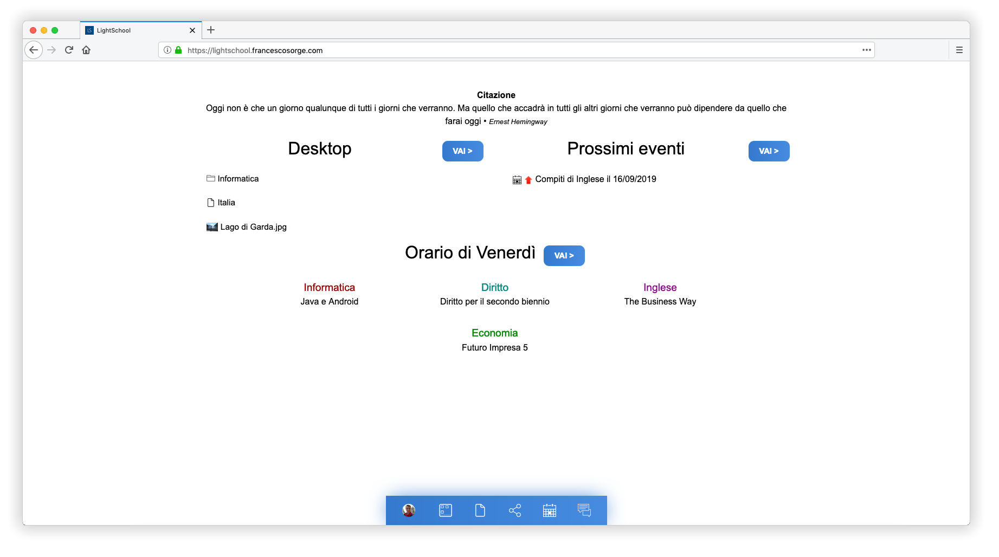

# LightSchool

A web-based school management platform with a desktop-like OS metaphor. Students and staff get a unified workspace with file management, messaging, diary, timetables, project tracking, and more — all behind a single login.

## Features

- **Authentication** — Registration with email verification, login, logout, password reset, two-factor authentication (TOTP), and passkey / WebAuthn support
- **File Manager** — Drive-like browsing with folder hierarchy and file sharing
- **Messaging** — Internal messaging system with conversation threads
- **Diary** — Personal calendar with month view
- **Timetable** — Class schedule management
- **Projects** — Collaborative projection / document sharing
- **Document Writer** — Rich-text editor powered by Quill
- **Reader** — In-browser PDF, image, and document viewer with optional Microsoft Office Online preview
- **Contacts** — Contact list with favorites and trash
- **Settings** — Themes, wallpapers, taskbar layout, security (2FA, passkeys, password), language, privacy, and data export
- **Trash** — Soft-delete and recovery for all item types

## Usage

### Cloud-based

LightSchool is **officially available** at [https://lightschool.francescosorge.com](https://lightschool.francescosorge.com) and you can start using it in a breeze!

That is the official instance maintained by the creator and that gets updated as soon as a new release gets out in the wild.

### Self-hosted

If you value **data sovereignty** and want to be in **full control** of the software (recommended for institutions, schools, universities, colleges, etc), LightSchool can be easily self-hosted via Docker.

See [docker-compose.yml](docker-compose.yml) to get started and adjust it to your needs.

## Upgrading from LightSchool 2020
LightSchool 2020 is the legacy, old-fashioned LightSchool built exclusively with PHP and an HTML-JS-CSS-PHP mixed together mess.

This repository contains the brand new LightSchool (simply "LightSchool"), to which you can upgrade your existing LightSchool legacy version.

1. Backup your existing installation of LightSchool 2020 (both users keyrings, users uploads and database) to a safe location

2. Replace LightSchool 2020 and point LightSchool to the existing files (keyring, uploads and database) by editing the `.env` file (use `.env.example` as a good starting point)

3. *(Skip if using Docker)* Install dependencies via `composer install && npm i && npm run build`

4. *(Skip if using Docker)* Run database migrations via `php artisan migrate --seed`

5. Start Docker services via `docker compose up` and check that everything starts correctly and no errors are printed

5. Migrate the LightSchool 2020 database to the LightSchool new format via `php artisan db:upgrade-ls-2020-schema`

6. If all steps completed successfully, that means the upgrade is done. You can now access LightSchool at its URL

## Tech Stack

| Layer | Technology |
|---|---|
| Language | PHP 8.5 |
| Framework | Laravel 13 |
| SPA / Routing | Inertia.js 3 |
| Frontend Framework | Svelte 5 |
| Icon Library | Phosphor Svelte 3 |
| Web server | Apache httpd (mod_rewrite, mod_proxy_fcgi) |
| Application server | PHP-FPM |
| Database | MariaDB 11 |
| Session / Cache / Queue | Database driver |
| Encryption | [defuse/php-encryption](https://github.com/defuse/php-encryption) ^2.4 (legacy) · libsodium (modern) |
| Crypto / SSH | [phpseclib/phpseclib](https://github.com/phpseclib/phpseclib) 2.0.52 |
| 2FA | [robthree/twofactorauth](https://github.com/RobThree/TwoFactorAuth) ^3.0 |
| Passkeys / WebAuthn | [spatie/laravel-passkeys](https://github.com/spatie/laravel-passkeys) · @simplewebauthn/browser |
| Rich-text editor | Quill (bundled) |
| Frontend build | Vite 8 + esbuild (TypeScript → `public/js/fra.js`) |
| Containerization | Docker + Docker Compose |

---

## Project Structure

```
.
├── app/
│   ├── Http/Controllers/
│   │   ├── Auth/              # Register, Login (+ 2FA), Logout, Password, Verify, OTP, PasskeyLogin
│   │   ├── PageController.php # Inertia renders for all page routes (public, auth, app)
│   │   ├── FileManagerController.php
│   │   ├── ContactController.php
│   │   ├── DataExportController.php
│   │   ├── DiaryController.php
│   │   ├── MessageController.php
│   │   ├── PasskeyController.php
│   │   ├── ProjectController.php
│   │   ├── SettingsController.php
│   │   ├── ShareController.php
│   │   ├── TimetableController.php
│   │   ├── TrashController.php
│   │   └── WriterController.php
│   ├── Http/Middleware/
│   │   ├── HandleInertiaRequests.php  # Shares appName, locale, currentUser, allApps, …
│   │   └── SetLocale.php
│   ├── Jobs/
│   │   └── ExportUserDataJob.php      # Background ZIP export
│   ├── Models/                        # Eloquent models (User, UserExpanded, File, Share, …)
│   └── Services/
│       ├── CryptoService.php          # Dispatcher: routes to Legacy or Sodium backend
│       ├── LegacyCryptoService.php    # Defuse AES-256-GCM (enc_version=1)
│       ├── SodiumCryptoService.php    # libsodium (enc_version=2)
│       └── KeyringService.php         # Ed25519 / RSA key management
├── resources/
│   ├── svelte/
│   │   ├── entries/app.ts             # Single Inertia entry (createInertiaApp)
│   │   ├── layouts/                   # AppLayout, AuthLayout, PublicLayout
│   │   ├── pages/
│   │   │   ├── app/                   # Authenticated app pages (FileManager, Diary, …)
│   │   │   ├── auth/                  # Auth pages (Login, Register, Verify, …)
│   │   │   └── public/                # Public pages (Home, Features, Tos, …)
│   │   ├── components/
│   │   │   ├── ui/                    # Reusable UI (Modal, ActionButton, PropertyPanel, …)
│   │   │   └── modals/                # Feature modals (ShareModal, DeleteModal, …)
│   │   ├── stores/                    # Svelte 5 reactive stores (notifications, themePreview, …)
│   │   └── lib/                       # Utilities (api.ts, i18n.ts, types.ts)
│   ├── ts/                            # Legacy Fra TypeScript (bundled via esbuild → fra.js)
│   ├── scss/                          # SCSS source files
│   └── views/
│       ├── app.blade.php              # Single Inertia root view
│       ├── layouts/partials/          # accent.blade.php (runtime accent-color CSS)
│       ├── mail/                      # Email templates
│       └── errors/                    # 404, 503 error pages
├── public/
│   ├── build/                         # Vite output (app.js, app.css, chunks/)
│   ├── js/                            # fra.js (legacy Fra bundle), Quill, etc.
│   └── css/                           # Compiled SCSS (lightschool-*.css, theme/dark.css, …)
├── lang/                              # i18n JSON files (en.json, it.json, …)
├── database/
│   ├── migrations/
│   └── seeders/
├── tests/
│   ├── Feature/
│   │   ├── Api/                       # Per-feature API contract tests
│   │   └── Auth/                      # Auth flow tests
│   └── Helpers/                       # TestUserFactory, MailpitClient
├── docker/
│   ├── apache/                        # Apache Dockerfile + vhost.conf
│   ├── php/                           # PHP-FPM Dockerfile
│   └── tests/                         # PHP CLI Dockerfile for Pest tests
├── docker-compose.yml
├── docker-compose.tests.yml
├── composer.json
├── package.json
└── .env.example
```

---

## Requirements

- [Docker](https://docs.docker.com/get-docker/) 24+
- [Docker Compose](https://docs.docker.com/compose/) v2 plugin
- [Composer](https://getcomposer.org/) 2 (only needed outside Docker)

---

## Local Development

### 1. Clone and configure

```bash
git clone <repo-url> lightschool
cd lightschool
cp .env.example .env
```

Edit `.env` with your local settings (the defaults work out of the box with Docker Compose).

### 2. Start the stack

```bash
docker compose up --build
```

This starts the following services:

| Service | Purpose | Local port |
|---|---|---|
| `apache` | HTTP server | `http://localhost:8080` |
| `php` | PHP-FPM application | internal |
| `db` | MariaDB 11 database | `localhost:3306` |
| `node` | Vite dev server (HMR) | `http://localhost:5173` |
| `worker` | Laravel queue worker | internal |
| `scheduler` | Laravel task scheduler | internal |
| `mailpit` | Fake SMTP + web UI | `http://localhost:8025` |

### 3. Open the app

Visit [http://localhost:8080](http://localhost:8080).

Register a new account. Because this is a local dev environment, all outgoing email is captured by Mailpit — open [http://localhost:8025](http://localhost:8025) to read it.

### 4. Stop the stack

```bash
docker compose down          # Stop containers, keep data
docker compose down -v       # Stop containers and wipe volumes (database, dependencies, etc.)
```

---

## Email Testing (Mailpit)

The dev stack bundles [Mailpit](https://mailpit.axllent.org/) — a local fake SMTP server with a web UI. All outgoing email is captured there instead of being delivered.

Mailpit web UI: [http://localhost:8025](http://localhost:8025)

---

## Running Tests

The test suite uses [Pest PHP 3](https://pestphp.com/) and runs entirely inside Docker — no local PHP or database required.

```bash
docker compose -f docker-compose.tests.yml up --build --abort-on-container-exit --exit-code-from tests
```

This spins up a fully isolated stack (`db`, `mailpit`, `php`, `apache`, `tests`) and tears it down after the run.

**What's tested:**

| File | Coverage |
|---|---|
| `Auth/RegisterTest.php` | Registration validation, full register → verify email cycle |
| `Auth/LoginTest.php` | Login success, rejections, 2FA flow |
| `Auth/LogoutTest.php` | Session teardown |
| `Auth/PasswordTest.php` | Password reset request and token flow |
| `Auth/VerifyTest.php` | Email verification token handling |
| `AuthTest.php` | End-to-end register → verify → login → logout cycle |
| `PublicPagesTest.php` | Landing page, features, overview, privacy, cookie pages |
| `ProtectedRoutesTest.php` | All `/my/app/*` routes return non-5xx to guests and show login UI |
| `ParameterizedRoutingTest.php` | URL rewriting for parameterized routes (contact/id, diary/id, writer/id, …) |
| `ApiContractsTest.php` | Controller endpoints return expected Content-Type and JSON structure |
| `Api/ContactTest.php` | Contact management API |
| `Api/DiaryTest.php` | Diary CRUD API |
| `Api/FileManagerTest.php` | File and folder operations API |
| `Api/MessageTest.php` | Messaging API |
| `Api/ProjectTest.php` | Project operations API |
| `Api/SettingsTest.php` | Settings updates API |
| `Api/ShareTest.php` | File sharing API |
| `Api/TimetableTest.php` | Timetable management API |
| `Api/TrashTest.php` | Trash and restore API |
| `Api/WriterTest.php` | Document writer API |

---

## Configuration Reference

All runtime config is driven by environment variables. Copy `.env.example` to `.env` and adjust as needed.

| Variable | Default | Description |
|---|---|---|
| `APP_URL` | `https://yourdomain.com` | Public base URL (used in emails and asset generation) |
| `APP_DEBUG` | `false` | Enable verbose error output |
| `DB_HOST` | `127.0.0.1` | Database hostname |
| `DB_DATABASE` | `lightschool` | Database name |
| `DB_USERNAME` | `lightschool` | Database user |
| `DB_PASSWORD` | `changeme` | Database password |
| `SESSION_DRIVER` | `database` | Session backend |
| `CACHE_STORE` | `database` | Cache backend |
| `QUEUE_CONNECTION` | `database` | Queue backend |
| `MAIL_MAILER` | `smtp` | Mail transport |
| `MAIL_HOST` | `mail.yourdomain.com` | SMTP hostname |
| `MAIL_PORT` | `465` | SMTP port |
| `MAIL_ENCRYPTION` | `ssl` | `ssl`, `tls`, or empty for none |
| `MAIL_FROM_ADDRESS` | `noreply@yourdomain.com` | Sender address |
| `MAIL_FROM_NAME` | `LightSchool` | Sender display name |
| `MAIL_PASSWORD` | — | SMTP password |
| `SECURE_DIR` | `/var/lightschool/secure` | Path for RSA keyring and secure file storage (outside web root) |
| `ALLOW_USER_UPLOADS` | `true` | Enable file uploads in the File Manager |

---

## Security Notes

- Passwords are hashed with bcrypt via Laravel's built-in auth.
- Each user has an Ed25519 key pair generated at registration, stored in `SECURE_DIR` (outside the web root).
- File content and messages are encrypted: legacy files use Defuse AES-256-GCM (`enc_version=1`); new files use libsodium (`enc_version=2`). The encryption key is wrapped with the user's public key.
- 2FA secrets are encrypted at rest with the user's public key.
- All email tokens (verification, password reset) are single-use and expire.
- Two-factor authentication (TOTP) is available per-user from the Settings app.
- Passkey / WebAuthn authentication is supported via `spatie/laravel-passkeys`.
